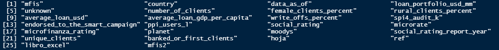

```{r setup, include=FALSE}
knitr::opts_chunk$set(echo = FALSE)
library(downloadthis)
```


# Objetivo

Mostrar la aplicación de herramientas de ciencia de datos para el manejo, análisis y visualización de datos como punto de partida a una variedad de soluciones para maximizar el valor de los datos.

# Metodología de trabajo

El trabajo realizado consiste en la estructuración e integración de información compartida por el equipo de BIM para después poder analizar y visualizarla.

Una vez estructurados los datos compartidos, se generan muestras de visualización como un ejemplo básico de las diversas alternativas y herramientas.

Todos los trabajos se realizaron con información de datos sociales dentro de las operaciones de Locfund II. A partir de esta información se desarrolló un código implementando herramientas y procedimientos que permiten automatizar el trabajo las diferentes etapas: Importación, estructuración, limpieza, integración, visualización, análisis y posteriores modelos.

Cada uno de estos procedimientos pueden ser desarrollados, adecuados e implementados en diferentes áreas y sectores, según las necesidades y alcances de cada uno.

# Estructuración de bases de datos

Como primer paso, antes de poder generar algún tipo de visualización o análisis, fue necesario estructurar e integrar los datos provistos por el equipo de BIM, generando una base de datos única. 

## Datos compartidos

<br>
<center></center>
<center><b>Imagen 1. Lista Excel</h3></b></center></b></center>
<br>

Fueron compartidos un total de ocho libros de Excel, mayormente con resultados de las operaciones de inversiones en instituciones microfinancieras (MFIs).

<br>
<center></center>
<center><b>Imagen 2. Hojas Excel</h3></b></center></b></center>
<br>

Los ocho libros de Excel contenían un total de 20 hojas de cálculo. La columna "hojas_excel" en la Imagen 2 muestra el nombre de todas las hojas de cálculo y a el libro de Excel al que corresponde.

## Revisión y estructuración 

Al realizar una revisión del contenido de los datos, se identificaron hojas de cálculo que no contenían información relacionada a los datos sociales. El código generado integra el total de las hojas de cálculo excluyendo las hojas identificadas previamente.

Para la integración de los datos y la información, únicamente se tomó en cuenta los datos crudos/principales. Esto quiere decir que se excluyeron fórmulas y tablas secundarias generadas a partir de los datos crudos/principales.


## Revisión del contenido 

Una vez generada la base de datos única se procedió a realizar un control de calidad general. En especial se busca verificar la consistencia y tipo de datos de cada una de las variables/columnas evitando contar con errores que afecten la visualización y análisis posterior. 

En este proceso se realizaron algunas correcciones y modificaciones:

<br>
<center></center>
<center><b>Imagen 3. Formatos Fechas</h3></b></center></b></center>
<br>

La Imagen 3 muestra los diferentes formatos de fechas importados para la variable "Data as of", correspondiente a la fecha en el que el reporte fue generado. Las fechas que contenían un formato erróneo fueron modificadas para ser tener un formato único y consistente.

Paralelamente se identificaron y corrigieron errores de dedo como por ejemplo la fecha "2029-08-01" que se presenta en la 7ma fila de la Imagen 3.

<br>
<center></center>
<center><b>Imagen 4. Nombres MFIs</h3></b></center></b></center>
<br>

Un segundo ejemplo de modificaciones es la variedad de nombres correspondientes a una misma institución microfinanciera. En la Imagen 4 se puede observar algunos ejemplos de nombres diversos que hacen referencia a una misma institución.

Si bien estas variaciones pueden tener algún propósito, se modificaron los nombres con el fin de mantener consistencia en la base única.

## Base de datos única

<br>
<center></center>
<center><b>Imagen 5. Variables Base</h3></b></center></b></center>
<br>


Finalmente se cuenta con una base de datos única general que está compuesta por 26 variables (columnas) y 740 filas (observaciones). De las 26 variables únicamente las variables "hoja", "ref", "libro_excel" y "mfis2" son ajenas a los datos originales. Estas dos variables fueron generadas como referencia a la hoja de Excel, número de referencia, libro de Excel y nombre de MFI modificado respectivamente. 

La base de datos general representa reportes que fueron generados a partir de mayo del 2015 hasta agosto del 2020 con información de cada institución financiera.

Se debe tomar en cuenta que el proceso de estructuración, limpieza e integración de datos se lo realiza completamente a través del código. Esto permite poder replicar el ejercicio las veces que sea necesario con los archivos y datos originales que se desee, pudiendo así incluir, reducir o modificar los documentos originales.


# Visualización datos general

El objetivo de los ejemplos que se muestran a continuación es presentar una idea de las herramientas que se pueden generar para analizar y comunicar datos e información. Estos ejemplos simplemente son el punto de partida a herramientas más elaboradas, que permiten incrementar la interacción del usuario en la selección y manejo de variables y rangos de visualización y análisis.

## Mapa de resumen

El siguiente mapa presenta los países donde se cuenta con operaciones. Cada país muestra información sobre el primer y último reporte generado.

<iframe frameBorder="0" src="output/graphs/summary_hcmap.html" width="100%" height=800 allowtransparency="true" allowfullscreen></iframe>

Se debe tomar en cuenta que la fecha inicial y final corresponden a fechas de presentación de reporte y no así al trimestre. 

## Tabla general

La siguiente tabla es una tabla interactiva que contiene el total de los datos integrados en la base de datos final:

<iframe frameBorder="0" src="output/social_reactable.html" width="100%" height=800 allowtransparency="true" allowfullscreen></iframe>
<br>

<center>
```{r warning=FALSE}

rio::import("output/data_set/social_quarterly.xlsx") %>%
  download_this(
    output_name = "base_locfund",
    output_extension = ".csv",
    button_label = "Descargar datos como CSV",
    button_type = "primary",
    has_icon = TRUE,
    icon = "fa fa-save"
  )
```
</center>

<br>
Al presionar el botón de descarga es posible descargar la base de datos consolidada en formato CSV.

<br><br>


## Línea de tiempo Portafolio por país

A continuación se cuenta con un gráfico que muestra el valor del portafolio correspondiente a cada país. Estéticamente el gráfico no es ideal y esto se debe a que todos los países están activados, sin embargo el gráfico permite activar y desactivar países presionando sobre estos en la leyenda.

Al pasar el cursor por las lineas se puede ver la fecha del reporte, el valor del portafolio y otra información correspondiente a este reporte.


<br>
<iframe frameBorder="0" src="output/graphs/hbr_line_countries.html" width="100%" height=800 allowtransparency="true" allowfullscreen></iframe>
<br>


## Línea de tiempo Portafolio Bolivia

A continuación se cuenta con un gráfico que muestra el valor del portafolio correspondiente a cada institución en Bolivia. Al pasar el cursor por las lineas se puede ver la fecha del reporte y el valor del portafolio.

Al igual que en el gráfico anterior,  es posible activar y desactivar las instituciones desdadas presionando en las instituciones en la leyenda inferior izquierda.

<br>
<iframe frameBorder="0" src="output/graphs/hbr_line_bolivia.html" width="100%" height=800 allowtransparency="true" allowfullscreen></iframe>
<br>

El anterior ejemplo muestra únicamente información de Bolivia, sin embargo es posible desarrollar herramientas para poder elegir los países de los cuales se quiere transmitir y visualizar información.

## Barras "drilldown"

El siguiente gráfico contiene datos extraidos del reporte correspondiente al último trimestre "Datos Sociales Quarterly Sep 20.xlsx". 

Al pasar el cursor por las barras se puede visualizar información resumida de cada país. Los porcentajes corresponden a promedios ponderados en función a la cantidad de clientes por cada operación.

Al presionar sobre alguna de las barras, el gráfico se expande para poder visualizar las instituciones que componen el país y la información de cada institución.

<br>
<iframe frameBorder="0" src="output/graphs/bar_drill_clients.html" width="100%" height=800 allowtransparency="true" allowfullscreen></iframe>
<br>


Como posibles implementaciones y desarrollos es posible habilitar la selección de fechas de reportes a ser visualizados.


# Indicadores Sociales


## Indicador % femenino Bolivia

El siguiente es un gráfico de barras compuestas que muestra la proporción y porcentaje de clientes de sexo femenino en los diferentes reportes en el tiempo.

Al pasar el cursor por las barras la información de cada reporte es visualizada.

Tomar en cuenta que la información transmitida corresponde a Bolivia.

<br>
<iframe frameBorder="0" src="output/graphs/hbr_stacked_fem_bol.html" width="100%" height=800 allowtransparency="true" allowfullscreen></iframe>
<br>

Como alternativas de desarrollo se pueden elaborar herramientas en las que puedas elegir el país que se quiera visualizar.

## Indicador % rural Ecuador

Al igual que el anterior gráfico, el siguiente es un gráfico de barras compuestas. En este ejemplo se muestra la proporción y porcentaje de clientes rurales en los diferentes reportes de tiempo.

Al pasar el cursor por las barras se visualiza la información correspondiente a cada reporte.

<br>
<iframe frameBorder="0" src="output/graphs/hbr_stacked_rur_ecu.html" width="100%" height=800 allowtransparency="true" allowfullscreen></iframe>
<br>

## Pirámide de proporciones en género

El siguiente gráfico muestra proporciones de clientes femeninos vs masculinos por cada institución en relación al valor del portafolio y la cantidad de clientes. 

El eje vertical muestra el valor correspondiente al portafolio y el eje horizontal la cantidad de clientes dividido en genero femenino y masculino.

Al pasar el cursor por las barras se visualiza la información correspondiente a la institución indicando a que país corresponde.

El gráfico corresponde al último reporte "Datos Sociales Quarterly Sep 20.xlsx".

<br>
<iframe frameBorder="0" src="output/graphs/hcpyram_female_clients.html" width="100%" height=800 allowtransparency="true" allowfullscreen></iframe>
<br>

Como herramientas complementarias se puede poner la opción para definir el periodo de visualización, ya sea una fecha específica o el trimestre correspondiente a una gestión. 

## Pirámide de proporciones por área

Al igual que el anterior gráfico el siguiente gráfico muestra proporciones de clientes rurales vs urbanos por cada institución en relación al valor del portafolio y la cantidad de clientes. El eje vertical muestra el valor correspondiente al portafolio y el eje horizontal la cantidad de clientes dividido en áreas rural y urbana.

Al pasar el cursor por las barras se visualiza la información correspondiente a la institución indicando a que país corresponde.

El gráfico corresponde al último reporte "Datos Sociales Quarterly Sep 20.xlsx".

<br>
<iframe frameBorder="0" src="output/graphs/hcpyram_rural_clients.html" width="100%" height=800 allowtransparency="true" allowfullscreen></iframe>
<br>

## Gráfico general % femenino vs % rural

En el siguiente gráfico cada burbuja representa una institución del último reporte "Datos Sociales Quarterly Sep 20.xlsx". Los ejes vertical y horizontal muestran la relación entre el porcentaje de clientes femeninos y el porcentaje de clientes en el área rural por cada institución. El tamaño de cada burbuja representa la cantidad de clientes correspondiente a la institución.

Al igual que en los demás gráficos, al pasar el cursor por cada burbuja se muestra la información correspondiente a la institución. De la misma manera, es posible activar y desactivar los países presionando en los mismos en la leyenda inferior.

<br>
<iframe frameBorder="0" src="output/graphs/scatter_rural_fem_clients.html" width="100%" height=800 allowtransparency="true" allowfullscreen></iframe>
<br>

Al igual que en los gráficos anteriores, es posible generar mayor desarrollo para, por ejemplo, poder definir el periodo de tiempo para visualización del gráfico.

# Conclusión

Este reporte es un producto de la implementación de herramientas y procesos de ciencia de datos. El trabajo descrito, transmitido y presentado en este reporte se genera a través de un código en lenguaje de programación R.

La aplicación de herramientas y procedimientos de ciencia de datos ofrecen una variedad de beneficios en todo el proceso de trabajo con datos, desde la automatización en la manipulación y manejo general de datos, el desarrollo de diversas herramientas y alternativas de visualización y comunicación, hasta la aplicación de modelos y herramientas de "machine learning" para la implementación de análisis predictivos.

Ciencia de datos no sólo permite hacer mas eficientes estos procesos, sino también agregar el valor a la información, facilitando el análisis y mejorando la transmisión de tendencias y resultados.

Cada área y sector es único y diferente, por lo tanto, la manera y el procedimiento de trabajar con datos debe ser desarrollada e implementada de manera personalizada, adecuándose a las características y requerimientos únicos de cada área.

En este ejemplo en particular, se trabajó con información de datos sociales correspondientes a diferentes inversiones en instituciones en latinoamerica. Después de generar una base de datos única se producieron ejemplos de visualización que permiten tener las primeras percepciones o "insights" sobre los datos, el comportamiento y tendencias en las instituciones.

La ciencia de datos ofrece alternativas para profundizar el análisis de la información, definir objetivos y desarrollar estrategias para alcanzar le impacto que se busca. Por ejemplo, se podría analizar el significado del incremento en el porcentaje de clientes mujeres y del sector rural, identificando y sugiriendo nuevas variables e indicadores que midan el impacto de estos porcentajes en el desarrollo de la economía y el bienestar de la sociedad.

La ciencia de datos permite integrar toda la información para poder implementar modelos y técnicas de machine learning y así predecir el impacto y resultados que nuevas decisiones y proyectos puedan generar. Simplemente es cuestión de tener acceso o poder generar los datos e información correcta e implementar las herramientas y conocimiento adecuado.


